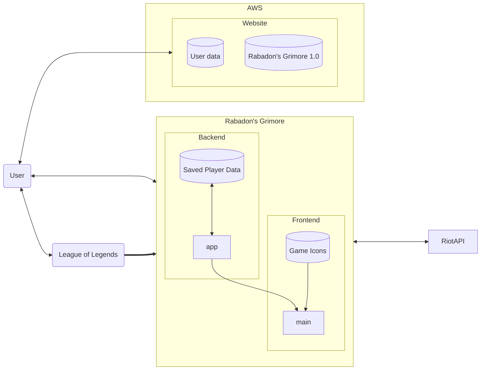

# Rabadon's Grimore
## *Technical Documentation*
|||
|-|--|
|**version**|1.0|
|**Developers**|Hunter Grimes,Michael Jung, Tarun Hoskere,Fernando Nunez,Erik Tkachenko|

## Getting Started
1. [Overview](#Overview)
2. [Requirements](#Requirements)
3. [Riot API](#API)
4. [App Backend](#AppBackend)
5. [App Frontend](#AppFrontend)
7. [Website](#Website)
## Overview{#Overview}
**Rabadon's Grimore** is a League of Legends companion app whose main goal is to help a player improve the way they are able to play the game, while also avoiding bloatware to provide the best experience with only what is needed. As such all work that has been made currently has been made with that goal in mind, and all future work should consider this as well before adding any new features or changes.
Below is a visual representation of the major parts of the project and the function of the parts.

## Requirements{#Requirements}
Before Attempting to change or add to the code it is important to ensure one understnds how to use python, html, and have installed or able to access the following (recommended to use following links for either installation or learning how to use):
1. [Python3](https://docs.python.org/3/index.html) (version 3.10 and above)
2. [Flask](https://flask.palletsprojects.com/en/3.0.x/)
3. [Flask restful](https://flask-restful.readthedocs.io/en/latest/)
3. [Flask-SqlAlchemy](https://flask-sqlalchemy.palletsprojects.com/en/3.1.x/) 
4. [SQLAlchemy](https://www.sqlalchemy.org/)
5. [Pyside6](https://pypi.org/project/PySide6/)
6. [Docker](https://docs.docker.com/manuals/)
7. [Willump](https://pypi.org/project/willump/)
8. [Django](https://docs.djangoproject.com/en/5.0/)
9. [Apache2](https://httpd.apache.org/docs/2.4/)
10. [cx_Freeze](https://pypi.org/project/cx-Freeze/)

## Riot API{#API}
As League of Legends(LOL) is an Multiplayer online battle arena (MOBA) game developed and published by Riot Games, the most important thing to have before working is API key from Riot.
The API key gives us the ability and permision to obtain data from LOL users to use in our app. An API key is required for the app to function and as such it is absolutely necessary for one to have a valid key for the app at all times. The current API key being used for the app has a request limit for each region (North America, Asia, etc.) of 20 per second, and 100 for every 2 minutes. This means focus should be used to ensuring every request is being used as effectively as possible, though this could change with if rate limit is increased in future updates.

For additinal info on the Riot API usage policies, features, and restrictions check: https://developer.riotgames.com/docs/lol
## App Backend{#App_Backend}
[Backend](./Backend.md)
## App Frontend{#AppFrontend}
[Frontend](./Frontend.md)
## Website{#}
While the website isn't our focus, it is the face of our product and as such must be properly maintained and visually appealing. It holds info about the app, about the developers, user data(usernames and password), and most importantly the download link for the app itself.
For a deeper explanation on the website visit the [Website](./Website.md) file.